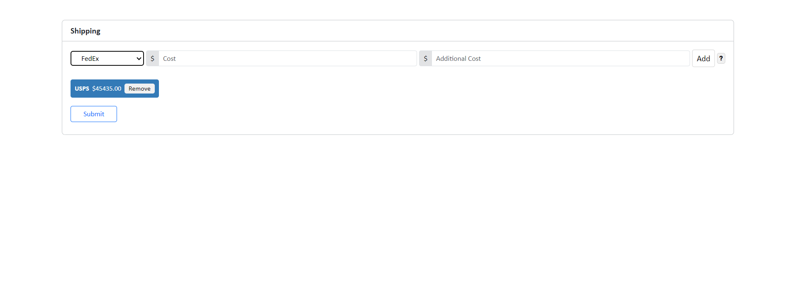
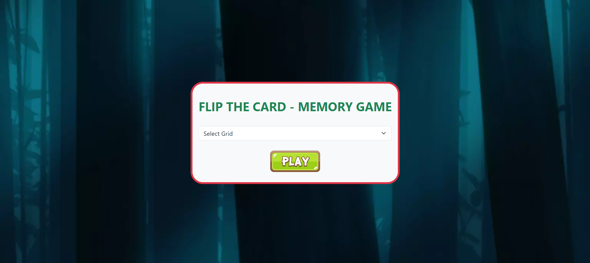
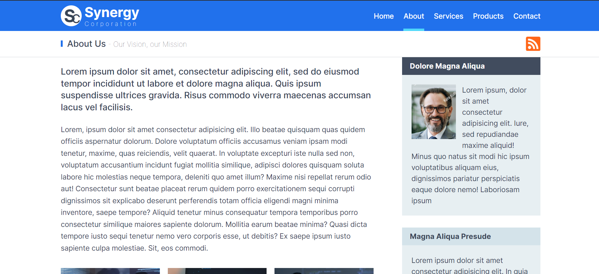
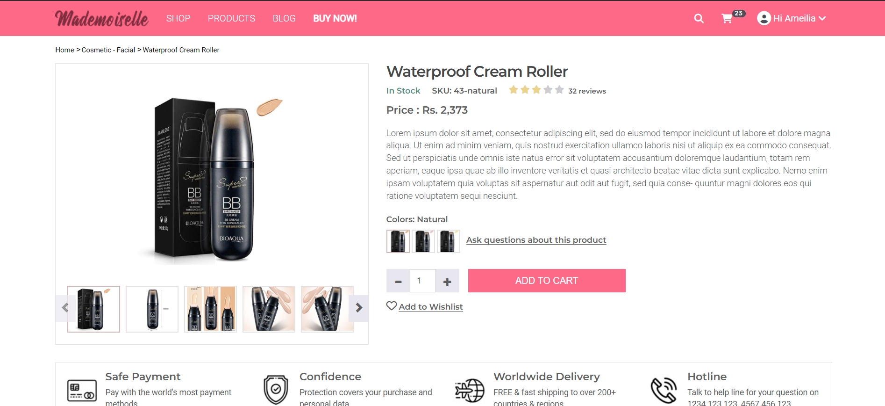
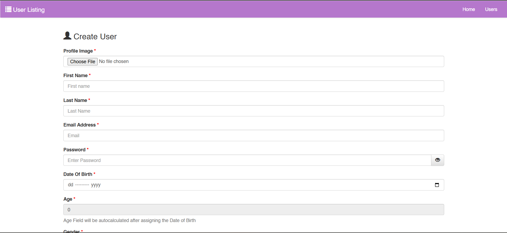

# Trainee Assignments

These Repository contains all my assignments done in the training period in **_Systenics Solution_**.

## Assignments Output Images:

1. JavaScript Task Image
   

2. JQuery Task Image
   

3. HTML & CSS Task Image
   

4. Bootstrap 3.4.1 Task Image
   

5. C# Task 2 Image
   

6. Angular Task Image
   

## Assignments Links

| Sr.No | Assignments | Link                                                                                        | Status  |
| ----- | ----------- | ------------------------------------------------------------------------------------------- | ------- |
| 1.    | JavaScript  | [Click Here](https://prathameshdhande22.github.io/Systenics-Trainee-Assignments/JS/Pages/)  | ✅      |
| 2.    | jQuery      | [Click Here](https://prathameshdhande22.github.io/Flip-Card-Memory-Game/)                   | ✅      |
| 3.    | HTML & CSS  | [Click Here](https://prathameshdhande22.github.io/Systenics-Trainee-Assignments/HTML&CSS/)  | ✅      |
| 4.    | Bootstrap   | [Click Here](https://prathameshdhande22.github.io/Systenics-Trainee-Assignments/Bootstrap/) | ✅      |
| 5.    | C#          |                                                                                             | ✅      |
| 6.    | MS SQL      |                                                                                             | ✅      |
| 7.    | Dapper       |                                 | ✅ |
| 8.    | Entity Framework |                        | ✅ |
| 9.    | LINQ To SQL    |                            | ✅ |
| 10.    | ASP.NET MVC    |                                        | ✅ |
| 11. | Angular | | ✅ |
| 12. | .NET Web API | | ✅ |
